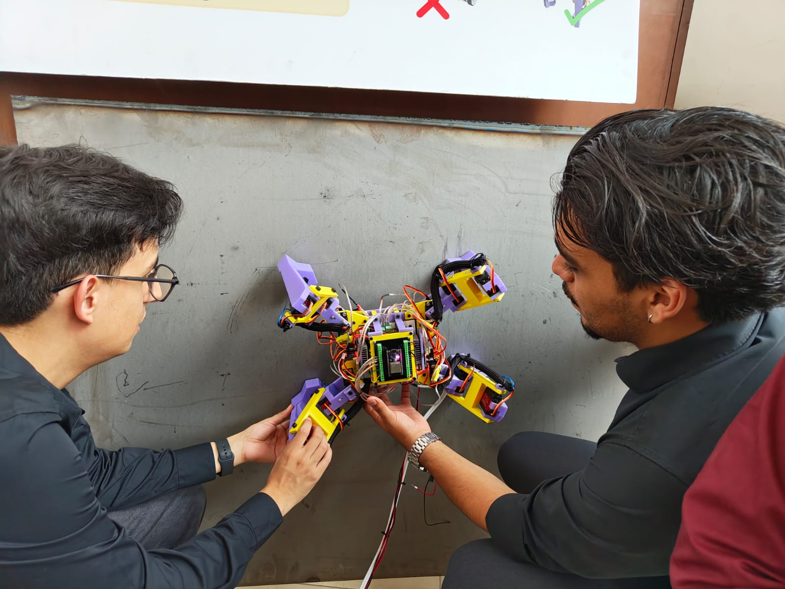
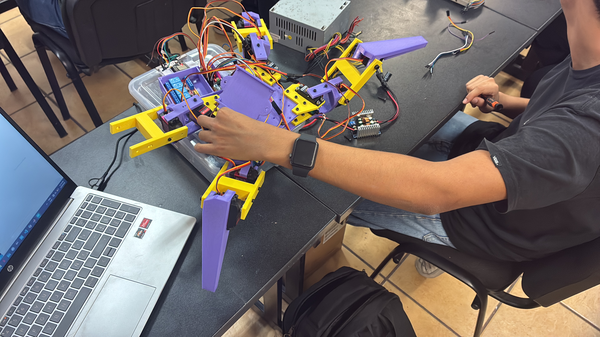
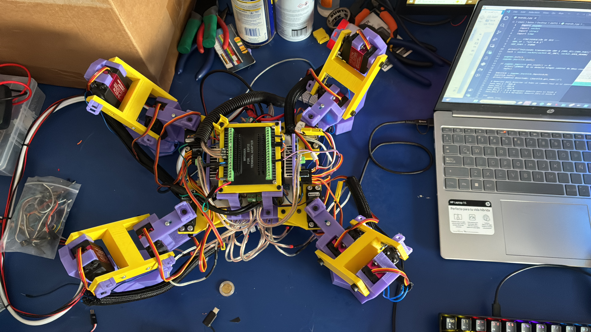
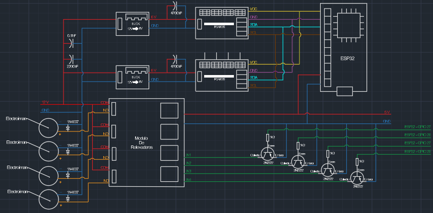
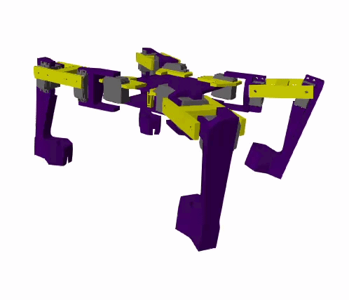

    

<h3 align="center">
All Magnetic Terrain Quadruped
</h3>

Magnetic Quadruped Robotic Platform for Industrial Maintenance Applications

---

# Table of Contents
- [Overview](#overview)
- [Developer Role](#developer-role)
- [The Problem & The Solution](#the-problem--the-solution)
- [Project Highlights](#project-highlights)
- [Technical Specifications](#technical-specifications)
- [Project Evolution](#project-evolution)
- [System Architecture](#system-architecture)
- [Mechanical Design](#mechanical-design)
- [Electronics & Embedded System](#electronics--embedded-system)
- [Kinematics](#kinematics)
- [MATLAB & Simulink](#matlab--simulink)
- [ROS2 Integration](#ros2-integration)
- [Manufacturing Process](#manufacturing-process)
- [Experimental Validation](#experimental-validation)

---

# Overview
**AMTQ (All Magnetic Terrain Quadruped)** is a multidisciplinary robotics project focused on the design, development, and experimental validation of a magnetic quadruped robotic platform intended for future industrial maintenance and inspection applications on ferromagnetic structures.

Unlike simulation-only academic projects, AMTQ has been physically designed, manufactured, assembled, programmed, and experimentally validated through multiple prototype iterations.

The project demonstrates the complete engineering workflow:
**Concept → Design → Simulation → Manufacturing → Integration → Testing**

---

# The Problem & The Solution

Large ferromagnetic structures (storage tanks, bridges, offshore platforms) require periodic maintenance. Traditional inspection methods (rope access, scaffolding) increase operational costs and expose workers to hazardous environments.

AMTQ proposes a magnetic quadruped robotic platform capable of controlled locomotion while maintaining adhesion on metallic surfaces, improving safety and enabling future autonomous maintenance operations.

 
<em>AMTQ tested on a vertical ferromagnetic surface</em>

---

# Project Evolution

## AMTQ V1 - Experimental Prototype
Focused on validating the mechanical concept and proving the feasibility of magnetic locomotion.

## AMTQ V2 - Advanced Robotics Platform
Focuses on improving system integration, control performance, and future autonomous operation with electromagnetic modules.

---

# System Architecture
The system is divided into four main layers: Mechanical, Control, Embedded, and Software.

---

# Mechanical Design
The mechanical system was designed using CAD tools with an emphasis on modular construction, structural rigidity, and weight optimization.

---

# Electronics & Embedded System
The embedded architecture is based on an **ESP32 controller** and custom hardware specifically designed for the robotic platform requirements, handling motor control, real-time commands, and electromagnetic adhesion.

---

# Kinematics
The robotic platform implements mathematical models for Forward and Inverse Kinematics, as well as trajectory generation to ensure smooth and precise movements.

---

# MATLAB & Simulink
MATLAB and Simulink are used for robot modeling, kinematic analysis, controller development, and simulation validation using a model-based design approach.

### Simulation in Action

 
<em>Simulated walking gait of the AMTQ platform</em>

---

# ROS2 Integration
ROS2 integration provides the foundation for future autonomous capabilities, including sensor integration, autonomous navigation, and computer vision.

---

# Manufacturing Process
The prototype was developed through CAD design, 3D printing/manufacturing, mechanical assembly, and electronics integration. 

---

# Experimental Validation
The physical prototype has been validated through multiple tests:

* **Mechanical Tests:** Individual leg movement, structural verification.
* **Locomotion Tests:** Walking sequence, trajectory execution.
* **Magnetic Adhesion Tests:** Electromagnetic attachment and vertical stability.
* **Control Tests:** Embedded control validation and MATLAB generated trajectories.

---
